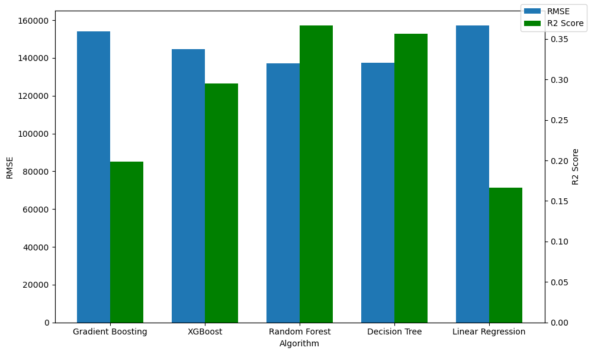

>본 문서는 2023-봄학기 AI-X:DL 팀프로젝트 Technical Report의 결과물로 작성되었습니다.

# 멤버 구성
김승호, 교육학과,[koridore987@hanyang.ac.kr](mailto:koridore987@hanyang.ac.kr)   
신지호, 기계공학부,[sjho4311@hanyang.ac.kr](mailto:sjho4311@hanyang.ac.kr)    
박소미, 미디어커뮤니케이션학과,[zzyan_9@naver.com](mailto:zzyan_9@naver.com) 

## 중점 활동

|팀원명|내용|
|---|---|
|김승호|데이터셋 탐색, 지오코딩, 데이터셋 피처엔지니어링, 데이터분석 코딩|
|신지호|데이터셋 탐색, 데이터셋 시각화|
|박소미|서론 작성 보조, 블로그 내용 작성 보조|

# I. 서론

한국에서의 사교육은 큰 중요성을 지닌다. 한국에서 사교육은 가계의 지출 1순위이자 사회 문제 중 하나로 꼽힌다. 학벌주의 사회 내에서 사교육은 계층 상승을 위한 수단으로 여겨지며, 부모는 자녀의 성공을 위해 사교육비 지출에 큰 힘을 쏟는다. 이러한 경향은 꾸준히 강화되는 추세를 보이고 있다. 

2023년 7월 교육부와 통계청이 조사한 '2022년 초중고교 사교육비 조사' 결과, 사교육 참여율과 사교육비가 역대 최대인 것으로 나타났다. 사교육비는 총 26조로 2021년에 달성한 최대치에 10.8%p나 더해진 수치이다. 사교육 참여율은 78.3%로 10명중 8명 가까이 사교육을 듣는다고 할 수 있다. 심지어 초등생의 사교육 참여율은 85.2%로 10명 중 8명 이상이 사교육을 받고 있는 것으로 나타났다. 매년 증가하는 사교육을 통해 알 수 있듯이 사교육은 이미 한국의 교육사회에 깊숙히 자리잡았다.<sup>[1](#footnote_1)</sup>

사교육 시장은 점차 늘어나고 있지만, 실제 수요자라 불릴 수 있는 학생의 수는 줄어들고 있다는 점이 주목할만 하다. 총량은 늘어나고 있지만, 서비스를 받는 고객이 줄어든다는 사실은 인당 부담해야 하는 비용이 증가하고 있다는 결론에 도달한다. 이는 점차 부담할 수 있는 가정과 그렇지 않은 가정으로 분리되는 상황으로 전개되며 경제적 격차가 교육의 격차를 만들 수 있다는 점을 시사한다.

사교육비가 늘어나게 된 요인은 무엇인가. 그리고 사교육비를 책정하는 요인들에는 어떤 것이 있는가. 다음과 같은 질문에 답하기 위해 본 팀프로젝트에서는 사교육의 중심이라 할 수 있는 서울 지역의 사교육비의 실태를 조사하고자 한다. 구체적으로는 다음과 같다.

> 1. 교습소의 특징(학원 과목, 수강생, 교습과정, 위치)등과 교습소를 둘러싼 환경적 변수(주변 학교의 특징)을 통해 현재 사교육비에 주요하게 미치는 요인이 무엇인지 살펴본다.
> 2. 교습비를 예측하는 모형을 평가하고, 최적의 모형을 탐색한다.

본 프로젝트에서는 서울 내 지역별 사교육비 실태를 분석하고, 나아가 특성별 사교육비를 예측하는 것을 목표로 한다. 또한 어떤 모형이 사교육비 예측에 적합한지 평가하고 최적의 모형을 선택, 분석할 것이다. 

---
# II. 데이터 설명

사용한 데이터셋은 총 2가지로, 세부 데이터셋의 설명은 다음과 같다.

## 1. 서울특별시교육청 학원 및 교습소 등록(신고) 교습비 현황

전국의 교습소는 「학원의 설립·운영 및 과외교습에 관한 법률」 제15조의5(정보의 공개)에 따라, 학원 등록 및 교습소 신고 여부, 교습비 등 현황을 공개해야 한다. 본 팀은 관련 법률에 의거해 공공데이터포털에 업로드된 데이터를 사용하였다. 업로드된 데이터는 서울시의 교육지원청별로 구분되어 작성되었다. 본 보고서에서는 서울에 있는 모든 11개의 지원청의 데이터를 종합해 작성하였다. 관련 데이터에 대한 자세한 정보는 다음과 같다.

|구분|내용|비고|
|--|--|--|
|제공기관|서울특별시교육청||
|관리부서명|평생교육과||
|등록일|2020-05-29||
|표본수|238,088||
|변수목록|관할교육청, 학원명, 학원종류, 분야구분, 학원주소, 교습과정, 교습과목(반) 등|총 23개의 열|

## 2. 서울시 학교 기본정보

이번 분석의 파생변수에 학원 주변의 학교 정보를 추가하기로 결정했다. 학교와 관련된(혹은 초중고등학교 학생과 관련된) 변수가 교습비에 영향을 미칠 것이라 생각했기 때문이다. 학원의 주변에 있는 학교를 찾기 위해 우선 학교 위치 데이터를 사용했다. 위치 정보는 공공데이터포털에 업로드된 '전국초중등학교위치표준데이터'를 사용하였다. 데이터의 자세한 정보는 아래와 같다.

|구분|내용|비고|
|--|--|--|
|소관기관|교육부||
|제공기관|청주대학교 지방교육재정연구원||
|표준데이터셋제공시스템|학구도안내서비스||
|등록일|2023-04-18||
|표본 개수|11,989||
|변수목록|학교ID, 학교명, 설립형태, 교육지원청명, 위도, 경도 등|총 18개의 열|

또한 관련 학교의 정보를 얻기 위해 추가적인 학교 현황 데어터를 사용하였다. 학교 정보는 학교 알리미에 공개되어있는 자료를 수집, 가공하였다.

```python
import pandas as pd
df_aca = pd.read_csv("{file path}", index_col=0) # 교습비 데이터
df_sch = pd.read_csv("{file path"}", index_col=0) # 학교 현황 데이터
```
___
# III. 데이터 전처리

## 1. 결측치 처리

학교 데이터를 받아오는 과정에서 학교 현황데이터와 학교 위치 데이터의 수집 시점이 일치하지 않아서 두 데이터를 병합하는 과정에서 발생하는 결측치가 존재했다. 학교 정보가 변경되었거나, 현재 폐교 등의 행정조치로 사라진 학교 등이다. 사라지거나 변경, 이전된 학교는 총 7개, 데이터가 변한 학교는 총 1개였다. 각 레이블을 확인해 직접 제거하는 코드를 작성, 실행했다.
|구분|대상 학교|
|--|--|
|변경|상일중학교(기존 상일여자중학교에서 공학으로 전환)|
|삭제|덕수고등학교, 개포중학교, 서울화양초등학교, 서울개원초등학교, 서울둔촌초등학교, 서울위례초등학교|

또한 학원 데이터의 결측치도 존재했다. 그 중 데이터 분석에 유의미한 영향을 미치는 결측치는 총 34개 학원으로, 교습계열, 교습시간, 총교습비 등 데이터 분석에 필요한 열의 값을 가지고 있지 않았다. 따라서 이 데이터들도 모두 삭제 처리 했다.
```python
df_aca.dropna(subset=['관할교육청', '학원명', '학원종류', '분야구분', '학원주소', '교습계열',
       '교습과정', '교습과목(반)', '정원', '교습기간', '총교습시간(분)', '교습비', '모의고사비', '재료비',
       '급식비', '기숙사비', '차량비', '피복비', '기타경비합계', '총교습비', '강사수', '위도', '경도'], inplace = True)
df_aca['months'] = df_aca.dropna()['교습기간'].str.extract(r'(\d+)개월').astype(int)
df_aca['days'] = df_aca.dropna()['교습기간'].str.extract(r'(\d+)일').astype(int)
df_aca['total_days'] = df_aca['months'] * 30 + df_aca['days']
```

## 2. 이상치 처리

교습소 교습비에 이상치가 존재했고, 이를 처리하는 과정을 거쳤다. 이상치가 발생한 이유로는 학원별로 교습과정을 설정하고 산출하는 방법이 다양하기 때문인 것으로 파악했다. 일례로 학원 교습비의 할인 내용을 교습과정에 포함시키기도 하고, 무료체험 등의 과정을 넣기도 해 교습비가 0인 값들이 존재했다. 또한 단위 역시 다양했는데, 원 단위가 아닌 천원 단위이거나 만원 단위인 것으로 의심되는 값들도 존재했다. 학원 교습과정의 교습비가 한 두 자리수인 경우 이에 해당한다고 보았다. 

![이상치 처리 전 교습비][이상치 처리 전 교습비]{: .align-center}{: width="60%" height="60%"}

따라서 본 프로젝트에서는 팀원들의 일관된 의견에 따라 다음 기준으로 데이터를 걸러내었다.
> 1) 교습 기간이 한달(1개월 0일)로 작성되어어 있는 행
> 2) 학원 종류가 평생직업교육학원이 아닌 행
> 3) 모의고사비, 재료비, 급식비 등 기타 교습비용이 0인 행
> 4) 총교습비가 5만원 이상 100만원 이하인 행

데이터에 대한 처리 코드는 다음과 같다.
```python
# 평생직업교육학원이 아닌 컬럼만 추출
df_aca = df_aca[df_aca.학원종류 != "평생직업교육학원"]

# 기타 교습비용 0이 아닌 행 제거
drop_list = ['모의고사비', '재료비', '급식비', '기숙사비', '차량비', '피복비', '기타경비합계']
for i in drop_list:
    df_aca = df_aca[df_aca[i] == 0]
df_aca = df_aca.drop(columns=drop_list)

# 총교습비가 5만원 이상 100만원 이하인 행 추출
df_aca = df_aca[df_aca.총교습비 >= 50000][df_aca.총교습비 <= 1000000]

# 교급기간이 한달로 작성되지 않은 행 제거
df_aca = df_aca[df_aca.months == 1][df_aca.days == 0]
```
## 3. 지오코딩을 이용한 학교 데이터 편집

### 3-(1). 네이버 지도 API를 이용한 지오코딩

이번 분석에서, 학원에서 일정 거리에 떨어져있는 학교의 특성을 반영한 데이터를 작성하고자 했다. 하지만 학원 데이터에는 주소만 나와있어서 거리를 측정해 새로운 변수를 만들어 내기는 어려운 상황이었다. 따라서 기존에 가지고 있는 학원의 주소 데이터를 가지고 위도와 경도 데이터로 변환해 거리를 측정하기로 하였다.   

지오코딩은 네이버 지도의 API<sup>[2](#footnote_2)</sup>를 이용해 주소에 대응하는 위도와 경도를 입력했다. API에서 널리 사용되는 json 파일 형식을 사용하기 위해 ```json```패키지, 그리고 네이버 API에 접근하기 위해 ```urllib```패키지를 사용하였다.  geocoding 과정에서 발생하는 결측치는 삭제처리했다. 학원이 없어졌거나, 지도 상에 등록되어있지 않은 학원이거나, 학원의 위치가 실제와 다른 경우들이었다.

```python
from urllib.request import urlopen
from urllib import parse
from urllib.request import Request
from urllib.error import HTTPError
import json

#naver map api key
client_id = '{팀원 아이디}'; 
client_pw = '{팀원이 할당받은 키}';
api_url = 'https://naveropenapi.apigw.ntruss.com/map-geocode/v2/geocode?query='
```

```python
# 네이버 지도 API 이용해서 위경도 찾기
def geocoding(add):    
    add_urlenc = parse.quote(add)  
    url = api_url + add_urlenc
    request = Request(url)
    request.add_header('X-NCP-APIGW-API-KEY-ID', client_id)
    request.add_header('X-NCP-APIGW-API-KEY', client_pw)
    try:
        response = urlopen(request)
    except HTTPError as e:
        print('HTTP Error!')
        latitude = None
        longitude = None
    else:
        rescode = response.getcode() #정상이면 200 리턴
        if rescode == 200:
            response_body = response.read().decode('utf-8')
            response_body = json.loads(response_body)   # json
            if response_body['addresses'] == [] :
                print("'result' not exist!")
                latitude = None
                longitude = None
            else:
                latitude = response_body['addresses'][0]['y']
                longitude = response_body['addresses'][0]['x']
        else:
            print('Response error code : %d' % rescode)
            latitude = None
            longitude = None
    return latitude, longitude
```

### 3-(2). 위경도를 통해 근방 1km 이내 학교 구하기

위도와 경도 데이터를 활용해 학원 근방 1km 내에 있는 학교 정보를 가져오기 위해 ```BallTree```의 ```harversine```구조를 사용했다. harversine 공식은 각 위경도 값을 라디안 값으로 가지기 때문에, ```numpy```의 ```deg2rad``` 메서드를 사용해서 각으로 변환 후, 각 지점을 ```BallTree```의 포인트에 대응시켜 거리를 구했다. 단, 이 공식은 지구를 완벽한 구라고 가정하고 곡면의 표면거리를 구하기 때문에 실제와는 오차가 있을 수 있지만, 일반적인 사용에서는 무리가 없다고 판단했다.

```python
import numpy as np
from sklearn.neighbors import BallTree
df_aca_rad = np.deg2rad(df_aca[['위도','경도']])
df_sch_rad = np.deg2rad(df_sch[['위도','경도']])

tree = BallTree(df_sch_rad, metric='haversine')
near_idc = []
distcrit = 1 # 1km
for point in df_aca_rad.values:
    idc =  tree.query_radius([point], r=distcrit/6371) # 지구 반지름 6371
    near_idc.append(df_sch.loc[idc[0],'학교ID'].tolist())

df_aca['near_idc'] = near_idc
```
![harversine 시각화[(출처: wikipedia)][위키백과Harversine출처]][visualization of harversines]{: .align-center}{: width="60%" height="60%"}

![harverine 공식][the law of haversines]{: .align-center}{: width="60%" height="60%"}

다음은 예시 학원의 근방 학교를 시각화한 것이다.   

![예시 학원 근방 학교 시각화][학원근방 학교 시각화]{: .align-center}{: width="60%" height="60%"}

### 3-(3). 근방 학교 현황 데이터 추출 

근방의 학교를 구한 후, 우리는 근방 학교의 학교 급별, 학교 설립유형 별 학교수와 학생수를 새로운 feature로 계산했다. 계산한 feature의 특성은 다음과 같다.

<center>**\<학교 급별 학생수\>**</center>   
![학교 급별 개수 boxplot][학교급별개수boxplot]{: .align-center}{: width="60%" height="60%"}   
<center>**\<학교 설립유형별 개수\>**</center>   
![학교 설립유형별 개수 boxplot][학교설립유형별개수boxplot]{: .align-center}{: width="60%" height="60%"}    
<center>**\<학교 급별 학생수\>**</center>   
![학교 급별 학생수 boxplot][학교급별학생수boxplot]{: .align-center}{: width="60%" height="60%"}     
자세한 계산 코드는 다음과 같다
```python
# 조건에 해당하는 학교 ID 추출해 반환하는 함수
def school_sort_df(target_col, target_value = [], school_ID=[]):
    school_df = df_sch[df_sch['학교ID'].isin(school_ID)]
    result_df = school_df[school_df[target_col].isin(target_value)].copy()
    return result_df

# 학교급별 학교 수와 학생 수 추출
df_group1 = df_aca_loc['near_sch'].groupby(['학교급']).agg({'학교급': 'count', '학생수(계)': 'sum'}).rename(columns={'학교급': 'count', '학생수(계)': 'std_count'}).reset_index()

# 설립 유형별 학교 수 추출
df_group2 = df_aca_loc['near_sch'].groupby(['설립']).agg({'설립': 'count'}).rename(columns={'설립': 'count'}).reset_index()

df_aca_loc = pd.merge(df_aca_loc, df_group1, on='학교급', how='left')
df_aca_loc = pd.merge(df_aca_loc, df_group2, on='설립', how='left')
```

## 3. '교습과목(반)'열 데이터 프로세싱

교습과목(반) 열에는 해당 학원에서 진행하는 교육 프로그램에 관한 세부적인 내용이 담겨있다. 하지만 학원별로 과정을 부르는 명칭이 다 다를 뿐만 아니라, 같은 학원에서 진행하는 내용이더라도 그 표현을 다르게 한 경우가 존재했다. 예를 들어 고등학교 2학년 학생을 대상으로 진행하는 국어 내신 대비 교습과정의 경우 한 학원에서는 '고2국어내신'이라고 표현하는 반면, 다른 학원에서는 '국(고등2)'라고 표현하는 등 다양했다. 해당 열은 처리하기 복잡하지만 내용이 많고 교습비를 예측하는 데 가장 큰 기여를 할 것으로 보여, 한국어 자연어처리 패키지인 ```konlpy```에서 한국어 토큰화 알고리즘 꼬꼬마(```Kkma```)한국어 형태소 분석기를 활용해 분석하였다.

아래는 토큰화 세부 코드이다.
```python
from konlpy.tag import Kkma
kkma = Kkma()

def pos(text):
    tk_list = []
    tk_text = kkma.pos(text)
    tk_list.append(tk_text)
    return tk_list[0]

    df['tk_text'] = df['교습과목(반)'].apply(pos)
```

그 후, Kkma 태깅 규칙<sup>[3](#footnote_3)</sup>에 따라 유효한 태깅만 리스트로 반환해 데이터에 추가하였다.
```python
import ast

tagging_list = ['NNG', 'NNP'] # 보통명사, 고유명사 태깅

def valid_tocken_choose(data):
    tagged_list = ast.literal_eval(data)
    tagged_dict = {word: pos for word, pos in tagged_list}
    selected_keys = [key for key, value in tagged_dict.items() if value in tagging_list]
    return selected_keys

df['select_tagged'] = df.tk_text.apply(valid_tocken_choose)
```
출력 예시는 다음과 같다
```python
[초등, 국, 영, 수, 전, 과목]
```

## 4.최종 데이터 시각화(ongoing)

(ongiong) - 지호님 파트, 여건상 어려우면 빼기

# IV. 사용한 알고리즘 설명
## 1. 선형회귀(Linear Regression)
본 프로젝트는 학생들의 교습비 예측 모델 구축을 목표로 한다. 이에 교습비와 연관이 있을 것 같은 외부 요인들을 통해 교습비 예측을 하기 위해 첫 번째로 선형 회귀 모델을 사용해 보았다. 선형 회귀는 종속 변수와 독립 변수 간의 선형 관계를 모델링하는데 사용되는 알고리즘으로, 외부 요인과 교습비 간의 선형 관계를 파악하고자 할 때 사용할 수 있다. 또한 선형 회귀 그래프를 통해 외부 요인과 교습비 간의 관계를 보다 효율적으로 예측하고자 했다.

### 1-1. 선형회귀란?
선형 회귀는 입력 변수와 출력 변수 사이의 선형 관계를 모델링하는 지도 학습 알고리즘이다. 선형회귀는 입력 변수와 가중치의 선형 조합을 통해 출력 변수를 예측하는 모델을 생성한다.
우선, 선형회귀 알고리즘은 입력 변수와 출력 변수 사이에 선형적인 관계가 있다는 가정 하에 사용된다. 또한, 입력 변수들이 서로 독립적이라고 가정하며 오차가 정규분포를 따른다 가정한다.

![LR][LR]{: .align-center}{: width="60%" height="60%"}   

단순 선형회귀에서는 하나의 입력 변수와 하나의 출력 변수 사이의 선형 함수를 학습해 선형 관계를 모델링한다. 이때, 선형회귀는 이러한 선형관계를 나타내기 위해 직선의 방정식을 사용한다. 선형회귀는 모델 학습에서 최소 제곱법을 이용하는데, 이를 통해 예측값과 실제값 차이의 오차를 최소화하는 가중치를 찾는다. 선형 회귀는 다른 알고리즘보다 복잡하지 않은 구조로 실행되기 때문에 계산을 보다 효율적으로 만들어줄 수 있다는 장점이 있다. 선형 회귀 알고리즘은 데이터가 선형 관계를 따른다고 가정할 때, 모델을 간단하게 해석할 수 있다. 

그러나 교습비가 비선형적 패턴을 갖거나 다른 요인들이 교습비에 영향을 미칠 가능성을 배제하지 못하기 때문에, 비선형적 패턴을 분석하기 위해 MLP 알고리즘을 이용했다.

## 2. MLP(Multi Layer Perceptrons)
여러 교육 관련 요소가 복잡하게 얽혀 있는 교습비는 복잡성을 가지고 있는 문제이므로, 다층 구조를 가진 MLP가 데이터의 복잡성 표현에 적합하다고 판단했다. MLP의 다층 구조 덕분에 다양한 패턴과 관계를 학습할 수 있으며, 따라서 MLP 알고리즘이 교습비의 이러한 비선형적인 특성을 잘 표현할 수 있을 것이라 판단이었다.

### 2-1. MLP란?
MLP(Multi-Layer Perceptron)은 인공 신경망(ANN)의 일종으로, 입력과 출력 사이에 여러 개의 은닉층(hidden layer)을 가진 다층 구조를 가진 퍼셉트론이다. 입력층, 여러 개의 은닉츨, 그리고 출력층으로 구성되어 있다.

![MLP][MLP]{: .align-center}{: width="60%" height="60%"}   

MLP의 입력층은 입력 데이터를 받아들이는 층이다. 입력층에 데이터가 입력되면, 은닉층은 비선형 활성화 함수를 사용해 입력층의 데이터 변환을 수행한다. 이때, 사용자는 은닉층의 수와 각 은닉층에 있는 뉴런의 수를 정의할 수 있으며, 이는 모델의 복잡성을 결정한다. 이후 최종 출력은 출력층에서 계산하여, 주어진 문제의 출력에 대한 예측이 이루어진다. 
그러나 MLP 알고리즘은 은닉층의 출력값에 대한 기준값을 정의할 수 없다는 문제가 있다. 따라서 MLP 알고리즘은 주로 역전파 알고리즘을 이용해 주어진 입력과 정답 데이터 사이의 가중치와 편향을 조정한다. MLP 알고리즘은 이를 통해 오차를 최소화하는 것을 목표로 한다. MLP 알고리즘은 구현과 이해가 다른 알고리즘에 비해 간단하다는 장점이 있다. 반면, 데이터가 많고 복잡할 경우 과적합에 유의해야 한다는 단점이 존재한다. MLP 알고리즘은 다양한 분야에서 사용되며, 예측, 패턴 인식, 추천 시스템 등의 문제 해결에 사용될 수 있다.

## 3.랜덤 포레스트(Random Forest)
교습비 예측을 위해서 가장 적합도가 높은 모델을 사용하기 위해, 여러 알고리즘을 사용해 보아야 한다는 판단 하에 랜덤 포레스트 모델을 사용해 보았다. 랜덤 포레스트는 선형, 비선형적 데이터 모두에 사용 가능하다는 특성을 지니고 있기 때문에 교습비 예측 모델 구축에 있어 도움이 될 것이라 봤다. 

### 3-1. 의사결정 트리란?
의사결정 트리는 트리 구조로 표현되며, 루트 노드(root node), 내부 노드(internal node), 리프 노드(leaf node)로 구성되어 있다. 의사결정 트리의 핵심은 데이터 분할 분기 기준의 선택이다. 분기 선택은 데이터의 불순도를 최소화하거나 정보 이득을 최대화하는 방향으로 선택된다. 그러나 의사결정 트리는 과적합 경향이 있어 일반화 성능이 떨어진다는 단점이 있다. 따라서 의사결정 트리는 과적합 경향을 해결할 필요가 있다. 이러한 과적합 경향은 앙상블 기법과의 조합을 통해 해결이 가능하기 때문에, 의사결정 트리와 함께 랜덤 포레스트가 사용된다.

### 3-2. 랜덤 포레스트란?

![RF][RF]{: .align-center}{: width="60%" height="60%"}   

랜덤 포레스트(Random Forest)는 여러 개의 의사결정 트리(Decision Tree)를 조합해 예측 모델을 구축하는 앙상블 학습(Ensemble Learning)알고리즘이다. 랜덤 포레스트는 의사결정 트리를 결합해 최종 예측을 수행한다. 각각의 트리를 독립적으로 예측한 후 결과를 결합해 다양성을 확보할 수 있기 때문에, 보다 정확한 결괏값을 얻어낼 수 있다. 또한, 랜덤 포레스트는 각 트리를 학습할 때 무작위하게 선택된 데이터 샘플을 사용한다. 이 때, 중복을 허용한 부트스트래핑(Bootstrap) 방식을 사용해 데이터를 샘플링하기 때문에, 다양성을 확보해 모델의 성능을 향상시킬 수 있다. 랜덤 포레스트는 각 의사결정 트리의 분할 기준을 결정할 때, 무작위한 특성들을 고려하기 때문에 다양성과 일반화 성능을 향상시킬 수 있다. 랜덤 포레스트는 다른 알고리즘보다 과적합 문제에서 자유롭고, 어떤 변수가 예측에 큰 영향을 주는지 확인할 수 있다. 또, 다양한 데이터 유형에 적용이 가능하고 데이터의 크기와 특성 수와 상관 없이 잘 작동하며, 안정적인 예측을 제공한다는 장점이 있다.

## 4. 사용 알고리즘 비교
### 4-1. 선형회귀와 MLP, 랜덤 포레스트
사용한 알고리즘은 총 세 가지로, 크게 선형적 관계를 예측하기 위해 사용한 선형 회귀 모델과, 비선형적 관계를 염두에 두고 사용한 MLP 알고리즘과 랜덤 포레스트 알고리즘으로 구분할 수 있다. 첫 번째로 사용한 선형 회귀는 알고리즘은 종속 변수와 독립 변수 간의 선형 관계를 모델링하는데 사용되는 알고리즘으로, 외부 요인과 교습비 간의 선형 관계를 파악하고자 할 때 사용할 수 있다. 
또한 시각적으로 제공되는 선형 회귀 그래프를 통해 외부 요인과 교습비 간의 관계를 보다 직관적으로 이해하고자 했다. 선형회귀 알고리즘은 선형적인 패턴을 가지고 있는 데이터셋의 예측에 유용하며 간단하고 해석이 쉽다는 특징을 띈다. 
그러나 비선형 관계를 포착하기 어렵고, 변수 간의 상호작용을 잘 모델링하지 못한다는 단점이 있다. 

### 4-2. MLP와 랜덤포레스트   
반면 MLP와 랜덤 포레스트는 선형회귀 알고리즘에 비해 비선형적 패턴을 지닌 데이터셋의 예측에 보다 용이하게 사용된다. MLP 알고리즘은 인공신경망 기반의 알고리즘으로, 역전파 알고리즘을 이용해 가중치를 조정하며 데이터의 패턴을 학습한다. 반면 랜덤 포레스트는 여러 개의 의사결정 트리를 동시에 학습하고, 결과를 결합해 최종 예측을 수행한다는 차이점이 존재한다. 따라서 은닉층과 가중치의 조합으로 데이터를 학습하는 MLP는 모델의 해석성이 상대적으로 낮을 수 있다는 단점이 존재한다. 그러나 랜덤 포레스트는 모델의 해석성은 상대적으로 높을 수 있지만 개별 트리의 결정 과정을 해석하기가 어렵다는 단점이 있다.

---
# V. 알고리즘별 적합 및 결과

- Graphs, tables, any statistics (if any)
우리는 데이터에 적합한 모형을 탐색하기 위해 네 가지 모형을 적합해가며 비교하였다. 종속변수가 연속형 변수이기 때문에, 모델의 평가에는 RMSE(Root Mean Squared Error)와 $R^2$ score를 사용하였다.

## 1. Linear Regression

- 다양한 머신러닝 알고리즘을 제공하는 scikit-learn 라이브러리를 이용하였다.
- 데이터 조작 및 분석을 위해 pandas 라이브러리를 이용하였다.

```python
#모듈 가져오기
from sklearn.linear_model import LinearRegression
from sklearn.model_selection import train_test_split
from sklearn.metrics import mean_squared_error, r2_score
from sklearn.preprocessing import OneHotEncoder

# 데이터셋 불러오기
data = pd.read_csv('{file path}')

모델을 적용시키기 전 전처리를 위해 데이터의 속성에 따라 칼럼들을 따로 모았다.
# 텍스트 칼럼 선택
text_columns = ['분야구분', '교습과정', 'address_gu']
# 리스트형 데이터 컬럼 선택
list_column = data['tk_subject']

# 정수 칼럼 선택
integer_columns = ['강사수', 'pub_count', 'priv_count', 'sch_count', 'sch_std_count']

# 타겟 컬럼 선택
target_column = '교습비'

머신러닝 모델에 범주형 데이터를 입력하기 위해 원핫 인코딩 적용
# 텍스트 데이터 인코딩
text_encoder = OneHotEncoder(sparse=False, sparse_output=False)
text_data_encoded = text_encoder.fit_transform(data[text_columns])
# 리스트형 데이터 인코딩
list_encoder = OneHotEncoder(sparse=False, sparse_output=False)
list_data_encoded = list_column.apply(lambda x: [x[0]] if len(x) > 0 else ['']).tolist()
list_data_encoded = list_encoder.fit_transform(list_data_encoded)

# 정수 데이터 선택
X_int = data[integer_columns]
```
인코딩한 데이터셋들을 정수 데이터셋과 결합하였다.
```python
# 입력 데이터 결합
X = pd.concat([pd.DataFrame(text_data_encoded), pd.DataFrame(list_data_encoded), X_int], axis=1)

X.columns = X.columns.astype(str)  # 열 이름을 문자열로 변환
y = data[target_column]
```
훈련 데이터셋과 평가 데이터셋의 비율을 8:2로 설정하고
Random state는 1로 설정했다.
```python
# 데이터셋 분할
X_train, X_test, y_train, y_test = train_test_split(X, y, test_size=0.2, random_state=1)
```
모델 학습부터 평가까지 수행하였다.
```python
# 선형 회귀 모델 학습
model = LinearRegression()
model.fit(X_train, y_train)

# 모델 예측
y_pred = model.predict(X_test)

# 모델 평가
mse = mean_squared_error(y_test, y_pred)
r2score = r2_score(y_test, y_pred)
rmse = np.sqrt(mse)
print('Mean Squared Error:', mse)
print('Root Mean Squared Error:', rmse)
print('R2 Score:', r2score)
```
```python
결과:
    Mean Squared Error: 24701299984.785465
    Root Mean Squared Error: 157166.47220315618
    R2 Score: 0.16631976349301347 
```
## 2. Regression tree

Linear regression 적용시킬 때와 마찬가지로, 다양한 머신러닝 알고리즘을 제공하는 scikit-learn 라이브러리를 이용하였다.
데이터 조작 및 분석을 위해 pandas 라이브러리를 이용하였다.
```python
from sklearn.tree import DecisionTreeRegressor # 회귀나무 패키지
```
데이터셋 파일을 불러오고, 모델을 적용시키기 전 데이터 전처리를 위해 데이터의 속성에 따라 칼럼들을 따로 모았다.
```python
# 텍스트 칼럼 선택
text_columns = ['분야구분', '교습과정', 'address_gu']
# 리스트형 데이터 컬럼 선택
list_column = data['tk_subject']

# 정수 칼럼 선택
integer_columns = ['강사수', 'pub_count', 'priv_count', 'sch_count', 'sch_std_count']
# 타겟 컬럼 선택
target_column = '교습비'
```
머신러닝 모델에 범주형 데이터를 입력하기 위해 원핫 인코딩 적용하였다.

```python
# 텍스트 데이터 인코딩
text_encoder = OneHotEncoder(sparse=False, sparse_output=False)
text_data_encoded = text_encoder.fit_transform(data[text_columns])
# 리스트형 데이터 인코딩
list_encoder = OneHotEncoder(sparse=False, sparse_output=False)
list_data_encoded = list_column.apply(lambda x: [x[0]] if len(x) > 0 else ['']).tolist()
list_data_encoded = list_encoder.fit_transform(list_data_encoded)

# 정수 데이터 선택
X_int = data[integer_columns]
```
인코딩한 데이터셋들을 정수 데이터셋과 결합하였다.
```python
# 입력 데이터 결합
X = pd.concat([pd.DataFrame(text_data_encoded), pd.DataFrame(list_data_encoded), X_int], axis=1)
X.columns = X.columns.astype(str)  # 열 이름을 문자열로 변환
y = data[target_column]
```
훈련 데이터셋과 평가 데이터셋의 비율을 8:2로 설정하고
Random state는 1로 설정했다.
```python
# 데이터셋 분할
X_train, X_test, y_train, y_test = train_test_split(X, y, test_size=0.2, random_state=1)
```
모델 학습부터 평가까지 수행하였다.
```python
# Decision Tree 모델 학습
model = DecisionTreeRegressor()
model.fit(X_train, y_train)
# 모델 예측
y_pred = model.predict(X_test)
# 모델 평가
mse = mean_squared_error(y_test, y_pred)
r2score = r2_score(y_test, y_pred)
rmse = np.sqrt(mse)
print('Mean Squared Error:', mse)
print('Root Mean Squared Error:', rmse)
print('R2 Score:', r2score)
```
```python
결과:
  Mean Squared Error: 18903917824.566864 
  Root Mean Squared Error: 137491.51910051348
  R2 Score: 0.3559961883087911
```

## 3. Random forest

Linear regression과 decision tree를 적용시킬 때와 마찬가지로, 다양한 머신러닝 알고리즘을 제공하는 scikit-learn 라이브러리를 이용하였다.
데이터 조작 및 분석을 위해 pandas 라이브러리를 이용하였다.
```python
from sklearn.ensemble import RandomForestRegressor
```

데이터셋 파일을 불러오고, 모델을 적용시키기 전 데이터 전처리를 위해 데이터의 속성에 따라 칼럼들을 따로 모았다.

```python
# 텍스트 칼럼 선택
text_columns = ['분야구분', '교습과정', 'address_gu']
# 리스트형 데이터 컬럼 선택
list_column = data['tk_subject']
# 정수 칼럼 선택
integer_columns = ['강사수', 'pub_count', 'priv_count', 'sch_count', 'sch_std_count']
# 타겟 컬럼 선택
target_column = '교습비'
```
머신러닝 모델에 범주형 데이터를 입력하기 위해 원핫 인코딩 적용하였다.
```python
# 텍스트 데이터 인코딩
text_encoder = OneHotEncoder(sparse=False, sparse_output=False)
text_data_encoded = text_encoder.fit_transform(data[text_columns])
# 리스트형 데이터 인코딩
list_encoder = OneHotEncoder(sparse=False, sparse_output=False)
list_data_encoded = list_column.apply(lambda x: [x[0]] if len(x) > 0 else ['']).tolist()
list_data_encoded = list_encoder.fit_transform(list_data_encoded)
# 정수 데이터 선택
X_int = data[integer_columns]
```

인코딩한 데이터셋들을 정수 데이터셋과 결합하였다.

```python
# 입력 데이터 결합
X = pd.concat([pd.DataFrame(text_data_encoded), pd.DataFrame(list_data_encoded), X_int], axis=1)
X.columns = X.columns.astype(str)  # 열 이름을 문자열로 변환
y = data[target_column]
```
훈련 데이터셋과 평가 데이터셋의 비율을 8:2로 설정하고
Random state는 1로 설정했다.
```python
# 데이터셋 분할
X_train, X_test, y_train, y_test = train_test_split(X, y, test_size=0.2, random_state=1)
```
모델 학습부터 평가까지 수행하였다.
```python
# Random Forest 모델 학습
model = RandomForestRegressor()
model.fit(X_train, y_train)
# 모델 예측
y_pred = model.predict(X_test)
# 모델 평가
mse = mean_squared_error(y_test, y_pred)
r2score = r2_score(y_test, y_pred)
rmse = np.sqrt(mse)
print('Mean Squared Error:', mse)
print('Root Mean Squared Error:', rmse)
print('R2 Score:', r2score)
```
```python
결과:
    Mean Squared Error: 18770672921.452454
    Root Mean Squared Error: 137006.10541670196
    R2 Score: 0.36648115483029375 
```

## 4. 모델 별 성능 정리

```python
[Linear regresssion]
Mean Squared Error: 24701299984.785465
Root Mean Squared Error: 157166.47220315618
R2 Score: 0.16631976349301347 

[Regression tree] 
Mean Squared Error: 18903917824.566864 
Root Mean Squared Error: 137491.51910051348
R2 Score: 0.3559961883087911 


[Ramdom forest]
Mean Squared Error: 18770672921.452454
Root Mean Squared Error: 137006.10541670196
R2 Score: 0.36648115483029375 
```

## 5. MLP

MLP는 Keras 패키지를 사용해서 적합하였다.

### 5-(1). 데이터 전처리: 수치형, 범주형 데이터

```python
np.random.seed(1) # numpy 랜덤시드 설정
tf.random.set_seed(0) # tensorflow 랜덤시드 설정

# 데이터 불러오기
data = pd.read_csv("{file_path}", index_col=0)
data.drop(columns=['교습과목(반)', 'tk_text'], inplace=True)
X = data.drop(columns='교습비')
y = data.교습비
```

수치형 데이터는 ```MinMaxScaler()```를 사용하여 0과 1 사이의 값으로 표준화하였고, 범주형 데이터는 원핫인코딩을 통해 더미변수로 확장하였다. 이는 MLP에서 입력층에 적용하기 위한 전처리 작업이다.

```python
# 수치형 데이터 처리: 표준화
int_columns = ['총교습시간(분)', '강사수', 'ele_count',
               'mid_count', 'high_count', 'sch_count', 'pub_count', 'priv_count',
               'ele_std_count', 'mid_std_count', 'high_std_count', 'sch_std_count']
object_columns = ['분야구분', '교습계열', '교습과정', 'address_gu']

scaler = MinMaxScaler()
scaled_data = X[int_columns].values
scaled_data = scaler.fit_transform(scaled_data)
scaled_df = pd.DataFrame(scaled_data, columns=int_columns)

# 범주형 데이터 처리: 원핫인코딩
categorical_data = X[object_columns]
encoder = OneHotEncoder()
encoded_data = encoder.fit_transform(categorical_data).toarray()
encoded_df = pd.DataFrame(encoded_data, columns=encoder.get_feature_names(object_columns))
```
### 5-(2). 데이터 전처리: 토큰화 데이터 Padding과 Indexing

또한, 교습과목(반)에서 토큰화된 내용역시 padding과 indexing을 사용하여 리스트로 만들었다.

```python
tknz = Tokenizer()
tknz.fit_on_texts(X['tk_subject'].values)
sequences = tknz.texts_to_sequences(X['tk_subject'].values) # 인덱싱
max_len = len(tknz.word_index) + 1 # 패딩을 위한 길이
padded_sequences = pad_sequences(sequences, maxlen=max_len, padding='post') # 패딩
```
### 5-(3). 데이터 분할

처리된 데이터들을 모두 모은 후, train과 test 데이터로 분할하였다. 훈련용 데이터와 검증용 데이터를 8:2로 구성했다. ```random_state```를 1로 설정해 모형간 비교가 가능하게 했다.
```python
# 데이터 분할
X_concat = pd.concat([scaled_df, encoded_df], axis=1)
X_train, X_test, y_train, y_test, sequences_train, sequences_test = train_test_split(
    X_concat, y, padded_sequences, test_size=0.2, random_state=1)
```
### 5-(4). 하이퍼파라미터 비교 및 최적화

그다음, 모형의 조율모수를 조정하면서 최적의 파라미터를 찾고자 했다.
```python
# 하이퍼파라미터 튜닝 및 모델 학습
epochs_list = [50, 100]
batch_sizes = [16, 32, 64]
results = []

for epochs in epochs_list:
    for batch_size in batch_sizes:
        # MLP 모델 적합
        max_length = padded_sequences.shape[1]
        input_numeric = Input(shape=(scaled_df.shape[1]))
        input_categorical = Input(shape=(encoded_df.shape[1]))
        input_text = Input(shape=(max_length,))
        embedding_dim = 3

        embedding = Embedding(input_dim=max_len, output_dim=embedding_dim, input_length=max_length)(input_text)
        flatten = Flatten()(embedding)
        concatenated = Concatenate()([input_numeric, input_categorical, flatten])
        hidden = Dense(10, activation='relu')(concatenated)
        output = Dense(1)(hidden)
        model = Model(inputs=[input_numeric, input_categorical, input_text], outputs=output)
        model.compile(optimizer='adam', loss='mean_squared_error', metrics=['mse'])
        model.summary()

        early_stopping = EarlyStopping(patience=5, monitor='mse', restore_best_weights=True)
        history = model.fit(
            [X_train[scaled_df.columns], X_train[encoded_df.columns], sequences_train], y_train,
            epochs=epochs, batch_size=batch_size, callbacks=[early_stopping], verbose=2
        )
        
        # 모델 평가
        loss, mse = model.evaluate([X_test[scaled_df.columns], X_test[encoded_df.columns], sequences_test], y_test)
        results.append((epochs, batch_size, loss, mse))
        
        print("Epochs:", epochs, "- Batch Size:", batch_size)
        print("Mean Squared Error (MSE):", mse)
        print("-----------------------------------")
```
구성한 모델의 세부 사항은 다음과 같다
```python
__________________________________________________________________________________________________
 Layer (type)                   Output Shape         Param #     Connected to                     
==================================================================================================
 input_27 (InputLayer)          [(None, 2312)]       0           []                               
                                                                                                  
 embedding_8 (Embedding)        (None, 2312, 3)      6936        ['input_27[0][0]']               
                                                                                                  
 input_25 (InputLayer)          [(None, 12)]         0           []                               
                                                                                                  
 input_26 (InputLayer)          [(None, 91)]         0           []                               
                                                                                                  
 flatten_8 (Flatten)            (None, 6936)         0           ['embedding_8[0][0]']            
                                                                                                  
 concatenate_8 (Concatenate)    (None, 7039)         0           ['input_25[0][0]',               
                                                                  'input_26[0][0]',               
                                                                  'flatten_8[0][0]']              
                                                                                                  
 dense_16 (Dense)               (None, 10)           70400       ['concatenate_8[0][0]']          
                                                                                                  
 dense_17 (Dense)               (None, 1)            11          ['dense_16[0][0]']               
                                                                                                  
==================================================================================================
Total params: 77,347
Trainable params: 77,347
```
팀원이 보유한 컴퓨터의 컴퓨팅 파워의 한계로 총 4가지의 경우를 적합, RMSE를 비교하였다. 비교한 그래프는 다음과 같다.   
![MLP 모형 RMSE 비교][MLP 모형 RMSE 비교]{: .align-center}{: width="60%" height="60%"}   

가장 낮은 RMSE를 보인 값은 ```Epochs = 100```, ```Batch_Size = 16```이었다. 따라서 이 값을 하이퍼 파라미터로 사용하기로 한다.

{: .align-center}{: width="60%" height="60%"}   

---
# VI. 결론 및 논의

본 팀보고서에서는 서울시교육청에서 제공한 공공데이터인 학원별 교습비용 데이터를 통해 학원을 예측하는 모형을 만들어 보았다. 지오코딩을 활용해 학교 데이터를 변수로 포함시켰고, 형태소분석기를 통해 학원별로 다르게 작성되어 있는 교습과목의 데이터에서 유효한 데이터를 추출, 가공하였다. 전처리된 데이터를 바탕으로 다양한 모형에 적합해보면서 어떤 모형이 가장 잘 예측하는지, 사교육 비용을 예측하는데 가장 적절한 모형이 어떤 것인지 찾고 선택하였다.

## 1. 머신러닝 알고리즘 모델별 비교

먼저 모델의 특성과 데이터셋의 특성을 연결해보았다.

Linear Regression은 선형 관계를 모델링하기 때문에, 데이터가 선형적으로 분포되어 있는 경우 예측 성능이 높을 수 있다. 예를 들어, 입력 변수와 타겟 변수 간에 직선적인 관계가 있을 때 Linear Regression은 해당 관계를 잘 표현할 수 있다. 비교적 단순한 데이터셋에서 Linear Regression은 모델의 복잡성이 낮아서 과적합의 위험이 적다. 따라서 작은 데이터셋이나 선형성이 높은 데이터셋에서는 다른 복잡한 모델보다 예측 성능이 높을 수 있다. 하지만 데이터셋이 비선형 관계를 가지거나 변수 간의 복잡한 상호작용이 있는 경우, Linear Regression은 성능이 제한될 수 있다. 이럴 때는 비선형 모델이나 복잡한 모델(예: Random Forest)이 더 적합할 수 있다.

현재 모델을 적용시킨 교습비 데이터셋은 명백하게 비선형 관계를 가지고, 변수 간에 복잡한 상호작용이 발생 할 수 있다. 이를 설명하기 위해 몇가지 예시를 들어보겠다.

**\[변수 추가 설명\]**

**분야구분과 교습과정:**    
교습비 데이터셋에서 '분야구분'과 '교습과정'은 텍스트 형태의 변수이다. 예를 들어, '분야구분'이 '수학'이고 '교습과정'이 '고등학교 수학'인 경우와 '분야구분'이 '과학'이고 '교습과정'이 '중학교 과학'인 경우의 교습비는 서로 다를 수 있다. 이처럼 텍스트 변수들 간에는 비선형적인 관계와 복잡한 상호작용이 발생할 수 있다.   

**주소와 교습비:**   
데이터셋에는 ```address_gu```라는 변수가 있다. 이 변수는 학원이 위치한 서울 시 행정구를 나타낸다. 서로 다른 행정구에서는 교습비가 다를 수 있으며, 이는 비선형적인 관계를 보여줄 수 있다.  
  
**리스트형 데이터와 교습비:**   
```tk_subject```라는 변수는 학원의 '반' 이름을 토큰화한 리스트 형태의 데이터이다. 이 리스트에는 학원이 가르치는 과목이나 대상 학생들의 학년이 포함될 수 있다. 예를 들어, 특정 학원의 '반' 이름이 ```['수학', '과학', '1학년']```인 경우와 ```['영어', '수학', '2학년']```인 경우에는 교습비가 다를 수 있다. 이처럼 리스트형 데이터들 간에는 변수들 사이의 복잡한 상호작용이 발생할 수 있다.   

위와 같이 비선형 관계와 변수 간의 복잡한 상호작용이 교습비 데이터셋에 존재할 수 있으며, 이는 Linear Regression과 같은 선형 모델의 성능을 제한할 수 있다.
따라서 비선형 모델이나 변수 간의 복잡한 상호작용을 고려하는 다른 모델들을 적용하여 예측 성능을 개선해야한다.

그래서 다음으로 Decision tree regression 과 random forest regression 을 적용하였고.예상대로 Linear regression 보다 개선된 성능을 보여주었다. 그리고 Random forest regression 은 Decision tree regression 보다 근소하게 더 높은 성능을 보여주었다. Linear regression 보다 decision tree 계열의 모델들이 더 높은 성능을 보인 이유에 대해서, 그리고 왜 Decision tree regression 과 Random forest regression 간에 성능 차이가 발생했는지 각 알고리즘의 원리와 데이터셋의 특징을 연결지어 생각해보자.

Decision Tree Regression은 입력 변수의 조건에 따라 데이터를 분할하고, 각 분할 영역에서 타겟 변수의 평균값을 예측으로 사용한다. 교습비 데이터셋의 특징에 따르면, Decision Tree Regression은 비선형 관계와 변수 간의 복잡한 상호작용을 고려할 수 있다. Decision Tree Regression은 각 변수의 임계값을 기준으로 분할을 수행하므로, 변수 간의 비선형 관계를 반영할 수 있다. 또한, Decision Tree Regression은 변수의 중요도를 평가하여 어떤 변수가 예측에 더 큰 영향을 주는지 알 수 있다. 따라서 교습비 데이터셋의 비선형성과 변수 간의 상호작용을 고려하여 Decision Tree Regression이 linear regression 보다는 높은 성능을 보일 수 있다.

그리고 Random Forest Regression이 Decision Tree Regression보다 약간 더 좋은 결과를 보여주는 것은 다음과 같은 이유로 설명될 수 있다.

**Ensemble 모델의 강점**
Random Forest Regression은 여러 개의 Decision Tree를 조합한 앙상블 모델이다. 앙상블 모델은 개별 모델의 약점을 보완하고 일반화 성능을 향상시킬 수 있다. Random Forest는 다양한 Decision Tree를 학습하고 이들의 평균 또는 투표를 통해 예측을 결정하기 때문에, Decision Tree Regression보다 더 좋은 예측 성능을 보일 수 있다.

**과적합 방지**
Random Forest는 각각의 Decision Tree를 무작위로 선택한 데이터로 학습하기 때문에, 과적합을 효과적으로 방지할 수 있다. 반면에 Decision Tree Regression은 데이터에 과적합될 가능성이 있다.
두 모델의 성능 차이가 크지는 않다. 이는 교습비 데이터셋의 특성에 따라서, 변수 간의 상호작용이나 비선형 관계가 제한적이기 때문일 수 있다. 또한, 데이터셋의 크기가 작아서 Random Forest가 그 이점을 충분히 발휘하지 못한 것일 수도 있다. 이러한 이유로 인해 Random Forest Regression과 Decision Tree Regression의 성능 차이가 크지 않았을 수 있다.

## 2. Multi-Layer Perceptron vs. Traditional Algorithms

MLP와 기존의 머신러닝 알고리즘을 모두 적합해 본 결과, 우리가 가지고 있는 데이터셋에서는 MLP보다 기존의 ML 알고리즘이 더 작은 test validation error를 보여주었다. 이는 MLP가 ML 알고리즘의 성능은 데이터 셋의 특징, 분석가의 데이터 가공 방법, 적절한 조율모수의 선택에 따라 달라질 수 있다는 점을 시사한다.

[![DL vs. ML][DLvs.ML]][DLvs.ML링크출처]{: .align-center}{: width="60%" height="60%"}

또한, MLP가 최대한의 성능을 내기 위한 데이터의 조건이 존재한다는 사실도 알 수 있었다. 특히, 딥러닝 알고리즘은 학습 데이터의 크기가 압도적으로 클 때 효과적으로 작동한다(James et al. 2021). 하지만, 이번 분석에서 사용한 데이터의 표본 수는 약 13만개이다. 더 나아가, 변수가 다양하지 못했다는 점, 한 학원에서 여러 교습과목을 가지고 있다는 점, 학원 고유의 데이터에 기반한 변수간의 상호작용이 존재했다는 점 등이 학습에서 실질적으로 유용한 데이터의 수을 훨씬 줄였을 것으로 예상된다. 

---
# VII. 출처 및 사용 패키지

본 보고서에 사용한 라이브러리와 참고문헌은 다음과 같다. 

## 1. 라이브러리

- pandas: 데이터 처리
- numpy: 데이터 계산
- sklearn: 머신러닝 모형 적합, 데이터 분류, 원핫인코딩
- urllib, json: 네이버 지도 API 사용
- konlpy.tag.Kkma: 텍스트 데이터 토큰화 ([꼬꼬마 홈페이지](http://kkma.snu.ac.kr/documents/index.jsp))
- ast: 토큰화 전처리
- matplotlob.pyplot: 시각화
- tensorflow, keras: MLP 모형 적합

## 2. 참고문헌

- [BallTree와 거리 계산][SklearnBalltree]
- [네이버 지도 API][네이버맵지오코딩설명서]
- [네이버 API를 이용한 지오코딩(Geocoding)by Kim][지오코딩블로그]
- 장철원(2021). 선형대수와 통계학으로 배우는 머신러닝. BJ퍼블릭.   
- James et al.(2021). An Introduction to Statistical Learning with Application in R      
- [visualization of harversines]: https://upload.wikimedia.org/wikipedia/commons/thumb/3/38/Law-of-haversines.svg/440px-Law-of-haversines.svg.png
- https://ko.wikipedia.org/wiki/%EB%9E%9C%EB%8D%A4_%ED%8F%AC%EB%A0%88%EC%8A%A4%ED%8A%B8
- https://hleecaster.com/ml-decision-tree-concept/
- https://hleecaster.com/ml-random-forest-concept/
- https://hleecaster.com/ml-linear-regression-concept/
- https://m.blog.naver.com/samsjang/221030487369
- https://velog.io/@cha-suyeon/%EB%8B%A4%EC%B8%B5-%ED%8D%BC%EC%85%89%ED%8A%B8%EB%A1%A0-Multilayer-Perceptron-MLP


---
# 각주   

<a name="footnote_1">1</a>: 교육부(2023). 2022 교육부 초등고교 사교육비 조사   
<a name="footnote_2">2</a>: 네이버 클라우드 플랫폼 [지오코딩 API 설명서][네이버맵지오코딩설명서]   
<a name="footnote_3">3</a>: 꼬꼬마 형태소 분석기 [태그 리스트][꼬꼬마분석기태그리스트]   

[학원근방 학교 시각화]: ./../_images/AI-X:DL/near_school.png
[이상치 처리 전 교습비]: ./../_images/AI-X:DL/tuition_outlier.png
[MLP 모형 RMSE 비교]: ../_images/AI-X:DL/MLP_output.png
[학교급별개수boxplot]: ../_images/AI-X:DL/sch_cnt.png
[학교설립유형별개수boxplot]: ../_images/AI-X:DL/sch_found_cnt.png
[학교급별학생수boxplot]: ../_images/AI-X:DL/sch_std_cnt.png
[DLvs.ML]: https://miro.medium.com/v2/resize:fit:1400/format:webp/1*uviv-FBuNKSbOiGwVSyvKw.png
[DLvs.ML링크출처]: https://medium.com/@sayondutta/nuts-and-bolts-of-applying-deep-learning-by-andrew-ng-89e1cab8b602
[꼬꼬마분석기태그리스트]: http://kkma.snu.ac.kr/documents/?doc=postag
[네이버맵지오코딩설명서]: https://api.ncloud-docs.com/docs/ai-naver-mapsgeocoding
[SklearnBalltree]: https://scikit-learn.org/stable/modules/generated/sklearn.neighbors.BallTree.html
[지오코딩블로그]: https://ring-wdr.github.io/python/2020/11/14/naver_map_api.html
[위키백과Harversine출처]: https://wikimedia.org/api/rest_v1/media/math/render/svg/106761cdc170f70bc88a524843b1eb997c27f06e
[the law of haversines]: https://wikimedia.org/api/rest_v1/media/math/render/svg/106761cdc170f70bc88a524843b1eb997c27f06e
[LR]: ../_images/AI-X:DL/LR.png
[MLP]: ../_images/AI-X:DL/MLP.png
[RF]: ../_images/AI-X:DL/RF.png