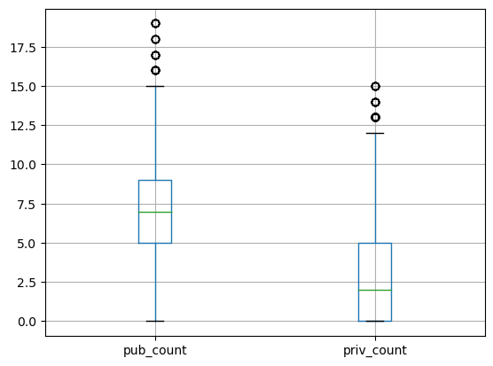

>본 문서는 2023-봄학기 AI-X:DL 팀프로젝트 Technical Report의 결과물로 작성되었습니다.

## Members
김승호, 교육학과,[koridore987@hanyang.ac.kr](mailto:koridore987@hanyang.ac.kr)   
신지호, 기계공학부,[sjho4311@hanyang.ac.kr](mailto:sjho4311@hanyang.ac.kr)    
박소미, 미디어커뮤니케이션학과,[zzyan_9@naver.com](mailto:zzyan_9@naver.com) 

### **중점 활동**
|팀원명|내용|
|--|--|
|김승호|데이터셋 탐색, 지오코딩, 데이터셋 피처엔지니어링, 데이터분석 코딩|
|신지호||
|박소미|서론 작성 보조, 블로그 내용 작성 보조|

# I. Proposal
>- Motivation: Why are you doing this?
>- What do you want to see at the end?

한국에서의 사교육은 큰 중요성을 지닌다. 한국에서 사교육은 가계의 지출 1순위이자 사회 문제 중 하나로 꼽힌다. 학벌주의 사회 내에서 사교육은 계층 상승을 위한 수단으로 여겨지며, 부모는 자녀의 성공을 위해 사교육비 지출에 큰 힘을 쏟는다. 이러한 경향은 꾸준히 강화되는 추세를 보이고 있다. 

2023년 7월 교육부와 통계청이 조사한 '2022년 초둥고교 사교육비 조사' 결과, 사교육 참여율과 사교육비가 역대 최대인 것으로 나타났다. 사교육비는 총 26조로 2021년에 달성한 최대치에 10.8%나 더해진 수치이다. 사교육 참여율은 78.3%로 10명중 8명 가까이 사교육을 듣는다고 할 수 있다. 심지어 초등생의 사교육 참여율은 85.2%로 10명 중 8명 이상이 사교육을 받고 있는 것으로 나타났다. 매년 증가하는 사교육을 통해 알 수 있듯이 사교육은 이미 한국의 교육사회에 깊숙히 자리잡았다.<sup>[1](#footnote_1)</sup>

사교육 시장은 점차 늘어나고 있지만, 실제 수요자라 불릴 수 있는 학생의 수는 줄어들고 있다는 점이 주목할만 하다. 총량은 늘어나고 있지만, 서비스를 받는 고객이 줄어든다는 사실은 인당 부담해야 하는 비용이 증가하고 있다는 결론에 도달한다. 이는 점차 부담할 수 있는 가정과 그렇지 않은 가정으로 분리되는 상황으로 전개되며 경제적 격차가 교육의 격차를 만들 수 있다는 점을 시사한다.

사교육비가 늘어나게 된 요인은 무엇인가. 그리고 사교육비를 책정하는 요인들에는 어떤 것이 있는가. 다음과 같은 질문에 답하기 위해 본 팀프로젝트에서는 사교육의 중심이라 할 수 있는 서울 지역의 사교육비의 실태를 조사하고자 한다. 구체적으로는 다음과 같다.(미결)

> 1. 교습소의 특징(학원 과목, 수강생, 교습과정, 위치)등과 교습소를 둘러싼 환경적 변수(주변 학교의 특징, 교통편의 형태 등)을 통해 현재 사교육비에 주요하게 미치는 요인이 무엇인지 살펴본다.
> 2. 특정한 조건을 가진 교습소가 어느정도의 교습비를 책정해야 하는지 예측하고, 현재 고평가된 (혹은 저평가된) 교습소는 어느 곳인지 살펴본다

학원에는 단과학원, 종합학원, 재수학원, 편입학원 등 입시 전문 학원과 공무원 학원 등을 포함하는 취업전문학원, 그리고 미술학원, 음악학원 등 예체능 전문학원 같이 다양한 종류가 있지만 본 프로젝트에서는 입시 전문 학원 중 (국어, 영어, 수학 등 정해진 과목을 가르치는) 단과학원과 종합학원에 한정하여 모델을 만들고자 한다.

본 프로젝트에서는 서울 내 지역별 사교육비 실태를 분석하고, 나아가 특성별 사교육비를 예측하는 것을 목표로 한다. 

---
# II. Datasets
사용한 데이터셋은 총 2가지로, 세부 데이터셋의 설명은 다음과 같다.

## 1. 서울특별시교육청 학원 및 교습소 등록(신고) 교습비 현황
전국의 교습소는 「학원의 설립·운영 및 과외교습에 관한 법률」 제15조의5(정보의 공개)에 따라 학원 등록 및 교습소 신고 교습비등 현황 공개해야 한다. 본 팀은 관련 법률에 의거해 공공데이터포털에 업로드된 데이터를 사용하였다. 업로드된 데이터는 서울시의 교육지원청별로 구분되어 작성되었다. 데이터는 서울에 있는 모든 11개의 지원청의 내용을 종합해 작성하였다. 데이터에 대한 자세한 정보는 다음과 같다.

|구분|내용|비고|
|--|--|--|
|제공기관|서울특별시교육청||
|관리부서명|평생교육과||
|등록일|2020-05-29||
|변수목록|관할교육청, 학원명, 학원종류, 분야구분, 학원주소, 교습과정, 교습과목(반) 등|총 23개의 열|

## 2. 서울시 학교 기본정보
이번 분석의 파생변수에 학원 주변의 학교 정보를 추가하기로 결정했다. 학교와 관련된(혹은 초중고등학교 학생과 관련된) 변수가 교습비에 영향을 미칠 것이라 생각했기 때문이다. 학원의 주변에 있는 학교를 찾기 위해 우선 학교 위치 데이터를 사용했다. 위치 정보는 공공데이터포털에 업로드된 '전국초중등학교위치표준데이터'를 사용하였다. 데이터의 자세한 정보는 아래와 같다.

|구분|내용|비고|
|--|--|--|
|소관기관|교육부||
|제공기관|청주대학교 지방교육재정연구원||
|표준데이터셋제공시스템|학구도안내서비스||
|등록일|2023-04-18||
|변수목록|학교ID, 학교명, 설립형태, 교육지원청명, 위도, 경도 등|총 18개의 열|

또한 관련 학교의 정보를 얻기 위해 추가적인 학교 현황 데어터를 사용하였다. 학교 정보는 학교 알리미에 공개되어있는 자료를 수집, 가공하였다.
___
# III. Methodology

## 1. Data Preprocessing
### 1-(1). 결측치 처리
학교 데이터를 받아오는 과정에서 학교 현황데이터와 학교 위치 데이터의 수집 시점이 일치하지 않아서 두 데이터를 병합하는 과정에서 발생하는 결측치가 존재했다. 학교 정보가 변경되었거나, 현재 폐교 등의 행정조치로 사라진 학교 등이다. 사라지거나 변경, 이전된 학교는 총 7개, 데이터가 변한 학교는 총 1개였다.
|구분|대상 학교|
|--|--|
|변경|상일중학교(기존 상일여자중학교에서 공학으로 전환)|
|삭제|덕수고등학교, 개포중학교, 서울화양초등학교, 서울개원초등학교, 서울둔촌초등학교, 서울위례초등학교|

또한 학원 데이터의 결측치도 존재했다. 그 중 데이터 분석에 유의미한 영향을 미치는 결측치는 총 34개 학원으로, 교습계열, 교습시간, 총교습비 등 데이터 분석에 필요한 열의 값을 가지고 있지 않았다. 따라서 이 데이터들도 모두 삭제 처리 했다.
### 1-(2). 이상치 처리
교습소 교습비 역시 이상치가 존재했다. 이는 학원별로 교습과정을 설정하고 산출하는 방법이 다양하기 때문인 것으로 파악했다. 일례로 학원 교습비의 할인 내용을 교습과정에 포함시키기도 하고, 무료체험 등의 과정을 넣기도 해 교습비가 0인 값들이 존재했다. 또한 단위 역시 다양했는데, 원 단위가 아닌 천원 단위이거나 만원 단위인 것으로 의심되는 값들도 존재했다. 학원 교습과정의 교습비가 한 두 자리수인 경우 이에 해당한다고 보았다. 

![이상치 처리 전 교습비][이상치 처리 전 교습비]

따라서 본 프로젝트에서는 팀원들의 일관된 의견에 따라 다음 기준으로 데이터를 걸러내었다.
> 1) 교습 기간이 한달(1개월 0일)로 작성되어어 있는 행
> 2) 학원 종류가 평생직업교육학원이 아닌 행
> 3) 모의고사비, 재료비, 급식비 등 기타 교습비용이 0인 행
> 4) 총교습비가 5만원 이상 100만원 이하인 행

## 2.Feature Engineering

### 2-(1). 네이버 지도 API를 이용한 지오코딩
이번 분석에서, 학원에서 일정 거리에 떨어져있는 학교의 특성을 반영한 데이터를 작성하고자 했다. 하지만 학원 데이터에는 주소만 나와있어서 거리를 측정해 새로운 변수를 만들어 내기는 어려운 상황이었다. 따라서 기존에 가지고 있는 학원의 주소 데이터를 가지고 위도와 경도 데이터로 변환해 거리를 측정하기로 하였다. 지오코딩은 네이버 지도의 API<sup>[2](#footnote_2)</sup>를 이용해 주소에 대응하는 위도와 경도를 입력했다. geocoding 과정에서 발생하는 결측치는 삭제처리했다. 학원이 없어졌거나, 지도 상에 등록되어있지 않은 학원이거나, 학원의 위치가 실제와 다른 경우들이었다.

```{python}
import pandas as pd
from urllib.request import urlopen
from urllib import parse
from urllib.request import Request
from urllib.error import HTTPError
from bs4 import BeautifulSoup
import json

#naver map api key
client_id = '{팀원 아이디}'; 
client_pw = '{팀원이 할당받은 키}';
api_url = 'https://naveropenapi.apigw.ntruss.com/map-geocode/v2/geocode?query='
```

```{python}
# 네이버 지도 API 이용해서 위경도 찾기
def geocoding(add):    
    add_urlenc = parse.quote(add)  
    url = api_url + add_urlenc
    request = Request(url)
    request.add_header('X-NCP-APIGW-API-KEY-ID', client_id)
    request.add_header('X-NCP-APIGW-API-KEY', client_pw)
    try:
        response = urlopen(request)
    except HTTPError as e:
        print('HTTP Error!')
        latitude = None
        longitude = None
    else:
        rescode = response.getcode() #정상이면 200 리턴
        if rescode == 200:
            response_body = response.read().decode('utf-8')
            response_body = json.loads(response_body)   # json
            if response_body['addresses'] == [] :
                print("'result' not exist!")
                latitude = None
                longitude = None
            else:
                latitude = response_body['addresses'][0]['y']
                longitude = response_body['addresses'][0]['x']
        else:
            print('Response error code : %d' % rescode)
            latitude = None
            longitude = None
    return latitude, longitude
```

### 2-(2). 위경도를 통해 근방 1km 이내 학교 구하기

위도와 경도 데이터를 활용해 학원 근방 1km 내에 있는 학교 정보를 가져오기 위해 {BallTree}의 {harversine}구조를 사용했다. harversine 공식은 각 위경도 값을 라디안 값으로 가지기 때문에, {numpy}의 {deg2rad}메서드를 사용해서 각으로 변환 후, 각 지점을 BallTree의 포인트에 대응시켜 거리를 구했다. 단, 이 공식은 지구를 완벽한 구라고 가정하고 곡면의 표면거리를 구하기 때문에 실제와는 오차가 있을 수 있지만, 일반적인 사용에서는 무리가 없다고 판단했다.

```{python}
df_aca_rad = np.deg2rad(df_aca[['위도','경도']])
df_sch_rad = np.deg2rad(df_sch[['위도','경도']])

tree = BallTree(df_sch_rad, metric='haversine')
near_idc = []
distcrit = 1 # 1km
for point in df_aca_rad.values:
    idc =  tree.query_radius([point], r=distcrit/6371) # 지구 반지름 6371
    near_idc.append(df_sch.loc[idc[0],'학교ID'].tolist())

df_aca['near_idc'] = near_idc
```
![harversine 시각화(출처: wikipedia)][visualization of harversines]
![harverine 공식][the law of haversines]

다음은 첫 번째 열에 있던 학원의 근방 학교를 시각화한 것이다.
![예시 학원 근방 학교 시각화][학원근방 학교 시각화]

### 2-(3). 근방 학교 현황 데이터 추출 
근방의 학교를 구한 후, 우리는 근방 학교의 학교 급별, 학교 설립유형 별 학교수와 학생수를 새로운 feature로 계산했다. 계산한 feature의 특성은 다음과 같다.


<center> 학교 급별 학생수 </center>


<center> 학교 설립유형별 개수 </center>


<center> 학교 급별 학생수 </center>


## 3. Algorithms or Methods

- Explaining your choice of algorithms (methods)
- Explaining features (if any)

## IV. Evaluation & Analysis
- Graphs, tables, any statistics (if any)

## V. Related Work (e.g., existing studies)
- Tools, libraries, blogs, or any documentation that you have used to do this project.

## VI. Conclusion: Discussion

[the law of haversines]: https://wikimedia.org/api/rest_v1/media/math/render/svg/106761cdc170f70bc88a524843b1eb997c27f06e
[visualization of harversines]: https://upload.wikimedia.org/wikipedia/commons/thumb/3/38/Law-of-haversines.svg/440px-Law-of-haversines.svg.png
[학원근방 학교 시각화]: ./../_images/AI-X:DL/near_school.png
<a name="footnote_1">1</a>: 2022 교육부 초등고교 사교육비 조사, 2023   
<a name="footnote_2">2</a>: 네이버 클라우드 플랫폼 지오코딩 API [설명서 링크](https://api.ncloud-docs.com/docs/ai-naver-mapsgeocoding)

[이상치 처리 전 교습비]: ./../_images/AI-X:DL/tuition_outlier.png